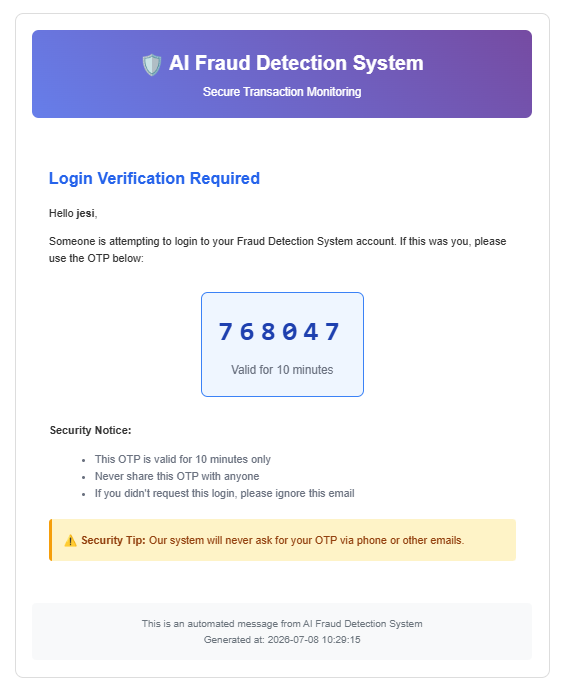
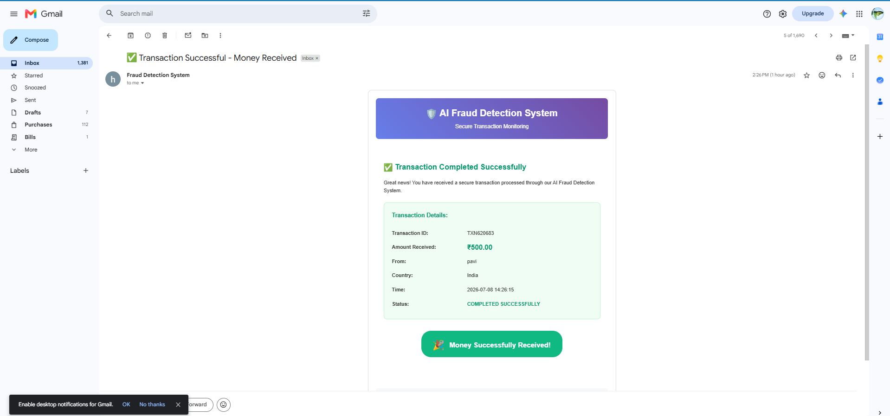
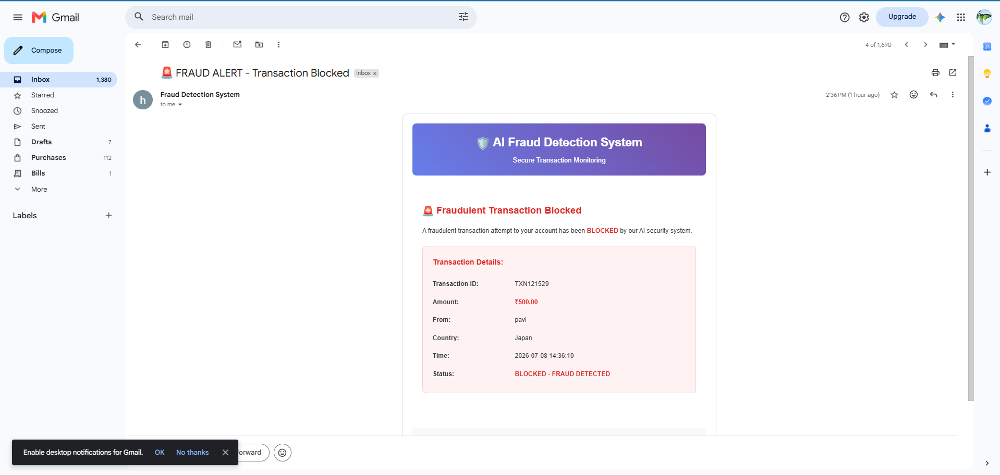

<div align="center">

# 💳 Financial Fraud Detection System

### 🛡️ AI-Powered Intelligent Banking Security Platform

<p align="center">
  
</p>

<h3>
🚀 Detect Fraud • Protect Users • Secure Transactions
</h3>

<p>

<a href="https://financial-fraud-detection-nsqprajemisgguc9iibvln.streamlit.app/">

</a>

<a href="https://github.com/pavithra23125/Financial-Fraud-Detection">

</a>

</p>

<p>


</p>

</div>

---

# 📖 About The Project

Financial fraud is becoming one of the fastest-growing cyber threats in today's digital banking ecosystem. Traditional rule-based systems often struggle to identify sophisticated fraud patterns such as VPN-based transactions, country switching, BIN manipulation, and repeated suspicious login attempts.

This project introduces an **AI-Powered Financial Fraud Detection System** that combines **Machine Learning**, **behavioural analytics**, and **real-time transaction monitoring** to intelligently detect suspicious financial activities while reducing false positives.

The application continuously analyses multiple risk factors including:

* 🌍 Country of Transaction
* 💳 BIN Number Validation
* 🌐 VPN Usage Frequency
* 🔄 Multiple Suspicious Attempts
* 📊 User Behaviour Pattern
* 🤖 Machine Learning Anomaly Detection

Based on these security checks, the system classifies every transaction as either **Legitimate** ✅ or **Fraudulent** 🚨.

---

# ✨ Project Highlights

<table>

<tr>
<td width="50%">

### 🔐 Secure Authentication

* Email OTP Verification
* Secure Login
* Session Management
* User Authentication

</td>

<td width="50%">

### 🤖 AI Fraud Detection

* Isolation Forest Model
* Behaviour Analysis
* Risk Prediction
* Real-Time Detection

</td>

</tr>

<tr>

<td>

### 📊 Smart Dashboard

* Live Analytics
* Fraud Statistics
* Pie Charts
* Correlation Analysis
* Transaction Monitoring

</td>

<td>

### 👨‍💼 Admin Panel

* User Management
* Transaction History
* Fraud Monitoring
* Database Records

</td>

</tr>

</table>

---

# 🌟 Why This Project?

Unlike a basic fraud detection demo, this application combines **multiple intelligent security layers** into a single platform.

✔️ AI-Based Fraud Detection

✔️ Country-Based Verification

✔️ BIN Number Validation

✔️ VPN Usage Detection

✔️ Automated Warning Emails

✔️ Multiple Attempt Detection

✔️ Interactive Banking Dashboard

✔️ SQLite Database Integration

✔️ Admin Monitoring Panel

✔️ Transaction Analytics

---

<div align="center">

### ⭐ If you like this project, don't forget to Star the Repository ⭐

</div>

---
---

# 🛡️ Security Modules

The application integrates multiple intelligent security mechanisms to detect fraudulent activities before financial loss occurs.

<table>

<tr>

<td width="50%">

## 🔐 Email OTP Authentication

Secure user authentication using One-Time Password (OTP) verification sent directly to the registered email address.

✔ Secure Login

✔ Email Verification

✔ Session Validation

✔ Unauthorized Access Prevention

</td>

<td width="50%">

## 🌍 Country-Based Fraud Detection

The system continuously monitors transaction origin.

If a transaction originates from an unusual country compared to previous user activity, the transaction risk score increases.

✔ Country Verification

✔ Geo-based Monitoring

✔ Suspicious Location Detection

</td>

</tr>

<tr>

<td>

## 💳 BIN Number Verification

Every transaction validates the card BIN (Bank Identification Number).

Unexpected BIN changes are treated as suspicious behaviour and analysed before approving the transaction.

✔ Card Validation

✔ BIN Consistency Check

✔ Fraud Prevention

</td>

<td>

## 🌐 VPN Usage Detection

The application monitors VPN usage frequency.

Repeated VPN usage during financial transactions increases the fraud probability and contributes to anomaly detection.

✔ VPN Detection

✔ Risk Calculation

✔ Behaviour Analysis

</td>

</tr>

<tr>

<td>

## 🚨 Multiple Attempt Detection

The application continuously tracks suspicious transaction attempts.

If users repeatedly perform suspicious activities, the system increases their risk level and initiates warning procedures.

✔ Attempt Counter

✔ Risk Escalation

✔ Fraud Prevention

</td>

<td>

## 📧 Automated Warning Emails

Legitimate users receive warning emails whenever repeated suspicious activities are detected.

Example:

> "You have performed multiple suspicious activities. Continued attempts may temporarily block your account."

✔ Email Notifications

✔ Security Alerts

✔ User Awareness

</td>

</tr>

</table>

---

# 🤖 AI Fraud Detection Engine

The core intelligence of the application is powered by an **Isolation Forest Machine Learning Model**.

Instead of relying only on predefined rules, the model identifies anomalies by learning the normal behaviour of financial transactions.

### 🔍 Model Workflow

```text
Transaction Request
        │
        ▼
Feature Extraction
        │
        ▼
Behaviour Analysis
        │
 ┌──────┼──────────────┐
 │      │              │
 ▼      ▼              ▼
Country BIN         VPN Usage
Check   Validation   Analysis
 │      │              │
 └──────┼──────────────┘
        ▼
Isolation Forest
Machine Learning Model
        │
        ▼
Fraud Score
        │
 ┌──────┴────────┐
 │               │
 ▼               ▼
Legitimate     Fraud
Transaction    Transaction
```

---

# 📊 Analytics Dashboard

The dashboard provides comprehensive insights into financial transactions through interactive visualizations.

### 📈 Dashboard Features

| Feature                  | Description                               |
| ------------------------ | ----------------------------------------- |
| 📊 Transaction Analytics | Analyse transaction activity in real time |
| 🥧 Pie Charts            | Fraud vs Legitimate Transactions          |
| 📉 Correlation Analysis  | Identify relationships between variables  |
| 📍 Country Statistics    | Country-wise transaction analysis         |
| 🚨 Fraud Statistics      | Fraud trend monitoring                    |
| 📜 Transaction History   | Complete transaction records              |
| 📋 Database Monitoring   | View stored user and transaction data     |
| 👨‍💼 Admin Insights     | Centralized monitoring dashboard          |

---

# 🛠️ Technology Stack

<div align="center">

| Category                   | Technologies                           |
| -------------------------- | -------------------------------------- |
| 👨‍💻 Programming Language | Python                                 |
| 🎨 Frontend                | Streamlit                              |
| 🧠 Machine Learning        | Scikit-learn (Isolation Forest)        |
| 🗄️ Database               | SQLite                                 |
| 📊 Visualization           | Plotly • Matplotlib • Seaborn • Altair |
| 📈 Data Processing         | Pandas • NumPy                         |
| 📧 Email Service           | SMTP (OTP & Warning Emails)            |

</div>

---

# ⚡ Core Functionalities

✅ Secure Email OTP Login

✅ Machine Learning Fraud Detection

✅ Country-Based Transaction Verification

✅ BIN Number Validation

✅ VPN Usage Monitoring

✅ Automated Email Notifications

✅ Real-Time Transaction Monitoring

✅ Admin Dashboard

✅ Interactive Analytics

✅ Fraud & Legitimate Transaction Classification

---
---

# 📸 Application Preview

The following screenshots showcase the major functionalities of the Financial Fraud Detection System.

---

## 🔐 Secure Login & Email OTP Verification

<div align="center">



</div>

<p align="center">

<b>Secure user authentication using Email OTP verification.</b><br>
Only authenticated users can access the transaction portal.

</p>

---

## ✅ Legitimate Transaction

<div align="center">



</div>

<p align="center">

<b>Successful Transaction Processing</b><br>

The transaction successfully passes all fraud validation layers including:

✔ Country Verification

✔ BIN Validation

✔ VPN Behaviour Analysis

✔ Machine Learning Risk Prediction

✔ Transaction Approval

</p>

---

## ❌ Fraudulent Transaction Detection

<div align="center">



</div>

<p align="center">

<b>Fraud Detected Successfully</b><br>

The application blocks suspicious transactions when abnormal behaviour is detected.

Possible reasons include:

🚨 Country Mismatch

🚨 BIN Number Change

🚨 VPN Usage

🚨 Multiple Suspicious Attempts

🚨 High Isolation Forest Risk Score

</p>

---

# 📂 Project Structure

```text
Financial-Fraud-Detection/
│
├── screenshots/
│   ├── login-otp.png
│   ├── successfull-transaction.png
│   └── failed-transaction.png
│
├── frauddetectionfinal.py
├── fraud_detection.db
├── requirements.txt
└── README.md
```

---

# ⚙️ Installation

### 1️⃣ Clone the Repository

```bash
git clone https://github.com/pavithra23125/Financial-Fraud-Detection.git
```

---

### 2️⃣ Navigate to the Project Folder

```bash
cd Financial-Fraud-Detection
```

---

### 3️⃣ Install Dependencies

```bash
pip install -r requirements.txt
```

---

### 4️⃣ Run the Streamlit Application

```bash
streamlit run frauddetectionfinal.py
```

---

# 🌐 Live Application

<div align="center">

### 🚀 Try the Live Demo

<a href="https://financial-fraud-detection-nsqprajemisgguc9iibvln.streamlit.app/">


</a>

</div>

---

# 📈 Future Enhancements

* 🔐 Multi-Factor Authentication (MFA)
* 📱 SMS & Push Notification Alerts
* ☁️ Cloud Database Integration
* 💳 Credit Card Blacklist Database
* 📊 Explainable AI for Fraud Decisions
* 🌍 Real-Time Geo-IP Intelligence
* 🤖 Deep Learning Based Fraud Detection
* 🏦 Banking API Integration
* 📡 Live Transaction Streaming
* 📉 Advanced Risk Scoring Engine

---

# 👩‍💻 Developer

<div align="center">

## Pavithra B

**Computer Science & Engineering Student**

Passionate about

Artificial Intelligence • Machine Learning • Data Analytics • Cyber Security • Full Stack Development

<p>

<a href="https://github.com/pavithra23125">

</a>

<a href="https://financial-fraud-detection-nsqprajemisgguc9iibvln.streamlit.app/">

</a>

</p>

</div>

---

<div align="center">

# ⭐ Thank You for Visiting!

If you found this project helpful or interesting,

please consider giving this repository a ⭐ **Star**.

It motivates future improvements and supports the project.

💙 Happy Coding!

</div>
